<!--
════════════════════════════════════════════════════════════════
  Profile README — Kushal D. Soni  (github.com/kushal-s0)
  Cards in assets/readme/ are generated by generator/build_readme_cards.py.
  Stats/snake cards come from the Actions workflow — see SETUP.md.
════════════════════════════════════════════════════════════════
-->

<picture>
  <source media="(prefers-color-scheme: dark)" srcset="./output/banner.svg">
  <source media="(prefers-color-scheme: light)" srcset="./output/banner.svg">
  
</picture>

 

&nbsp;

&nbsp;

&nbsp;

&nbsp;

  

 

<!-- ─────────────────────────────── 01 · ABOUT ─────────────────────────────── -->


 


### 🚀 Who Am I?

I'm a **Computer Engineering student (Honors in AI & ML)** who builds at the intersection of **Generative AI**, **Applied Machine Learning**, and **Full Stack Development**.

Most of my work starts with the same question: *what is someone doing manually right now that a system should be doing for them?* That's how a hospital resource-management platform became an **agentic AI system** forecasting bed occupancy and medicine inventory across multiple hospitals. It's how a college's paperwork-heavy event process became **CommUnity**, a Django portal that approves events and then writes its own post-event reports. And it's how a chemistry lab students can't safely experiment in became **Atomix**, a 3D virtual lab with an AI tutor.

> [!TIP]
> I care less about writing clever code and more about shipping software that quietly removes work from people's days.


  

<!-- ────────────────────────────── 02 · HIGHLIGHTS ────────────────────────────── -->


 


🥇 **IET InTech 2K26 Winner (National)** &nbsp;·&nbsp; 🥇 **TechnoGenesis 2K24 Winner** &nbsp;·&nbsp; 🥈 **Somaiya AI-Robo Festival 2026** &nbsp;·&nbsp; 🎤 **CIIA National Innovation Showcase** &nbsp;·&nbsp; 🌏 **Deloitte Australia Job Simulation**

 

<!-- ────────────────────────────── 03 · EXPERIENCE ────────────────────────────── -->


 

<table>
<tr>
<td width="33%" valign="top">

**🤖 Claidroid Technologies** 
Generative AI & Agentic AI Intern 
 
🌐 Remote

</td>
<td width="33%" valign="top">

**📈 Claidroid Technologies** 
Machine Learning Intern — Finance 
 
🌐 Remote

</td>
<td width="33%" valign="top">

**🌏 Deloitte Australia** 
Technology Job Simulation 
 
🧩 Forage

</td>
</tr>
</table>

<b>🤖 Generative AI &amp; Agentic AI Intern — Claidroid Technologies</b> &nbsp;·&nbsp; <i>Dec 2025 – Jan 2026</i>

 

Built a **scalable AI-powered Hospital Management System** in Python using **Agentic AI**, integrating multiple predictive models into a single decision layer:

- **Bed occupancy forecasting** — anticipating capacity pressure before it hits
- **Medicine inventory forecasting** — reducing stock-outs and over-ordering
- **Intelligent hospital resource management** across multiple hospitals in the organization

Designed AI workflows that combine **Weather APIs**, live **inventory data**, and machine learning models so administrators receive data-driven decisions instead of raw dashboards.

`Python` · `Agentic AI` · `Generative AI` · `Forecasting` · `REST APIs`

<b>📈 Machine Learning Intern — Finance</b> &nbsp;·&nbsp; <i>Jun 2025 – Jul 2025</i>

 

Worked hands-on with **financial datasets** in Python across the full modelling loop — **data preprocessing**, **feature engineering**, and rigorous **machine learning model evaluation**.

`Python` · `Pandas` · `scikit-learn` · `Feature Engineering` · `Model Evaluation`

<b>🌏 Deloitte Australia — Technology Job Simulation (Forage)</b>

 

- Completed technology-focused, client-style tasks simulating real-world consulting scenarios
- Gained exposure to problem-solving, system analysis, and applying technical concepts in business contexts

 

<!-- ─────────────────────────────── 04 · PROJECTS ─────────────────────────────── -->


 

<table>
<tr>
<td width="50%" valign="top">

<a href="https://github.com/Dhir-learner/Atomix"></a>

  

A **Unity-based 3D virtual chemistry lab** where students run experiments that would be unsafe, expensive, or impossible in a real classroom.

- Interactive 3D experiments, safe free-hand experimentation
- AI-assisted guidance
- **Real-time molecular visualization** of what's happening in the beaker

🥇 *Winner — IET InTech 2K26 (National Level)*

</td>
<td width="50%" valign="top">

<a href="https://github.com/Interior-Gardener/Geoswipe"></a>

   

Explore the planet **without touching a mouse** — a fully interactive 3D Earth navigated through real-time **hand gesture recognition**.

- **110+ UNESCO heritage sites** with AI itinerary generation
- Google Street View & 3D models
- Location-based quizzes and country identification
- Real-time escape route planning

🥈 *2nd Prize — Somaiya AI-Robo Festival 2026* · 🎤 *CIIA Showcase*

</td>
</tr>
<tr>
<td width="50%" valign="top">

<a href="https://github.com/kushal-s0/CommUnity"></a>

  

Replaces the paperwork trail behind every college event. A committee raises an event, it moves through an **automated approval workflow**, and once it's over the system **writes the post-event report itself**.

- Role-based access control
- SQL-backed relational database + backend REST APIs
- **AI-powered document generation** for post-event reports
- **Google Calendar API** integration for scheduling

</td>
<td width="50%" valign="top">

<a href="https://github.com/kushal-s0/AI-Based_Internship_Recommendation_Engine"></a>

  

Matches students to internships using **similarity scoring** rather than keyword search, wrapped in a database-backed web app so the matching data stays manageable.

- Data preprocessing pipeline & feature engineering
- Similarity-based recommendation engine
- Database-backed web application for matching & data management

</td>
</tr>
</table>

 

<!-- ──────────────────────────────── 05 · STACK ──────────────────────────────── -->


 

<table>
<tr>
<td align="center" width="160"><b>💬 Languages</b></td>
<td align="center"></td>
</tr>
<tr>
<td align="center"><b>🎨 Frontend</b></td>
<td align="center"></td>
</tr>
<tr>
<td align="center"><b>⚙️ Backend</b></td>
<td align="center"></td>
</tr>
<tr>
<td align="center"><b>🗄️ Databases</b></td>
<td align="center"></td>
</tr>
<tr>
<td align="center"><b>🧰 Tools & Platforms</b></td>
<td align="center"></td>
</tr>
<tr>
<td align="center"><b>🧠 AI / ML & Data</b></td>
<td align="center">

Data Preprocessing • Feature Engineering • Data Analysis • ETL Concepts • Relational Database Design

</td>
</tr>
</table>

 

<!-- ────────────────────────────── 06 · ANALYTICS ────────────────────────────── -->

 

  

<!--
  The three cards below (stats, top-langs, snake) are generated by
  .github/workflows/generate-profile-assets.yml and pushed to the `output` branch.
-->

  

<picture>
 <source media="(prefers-color-scheme: dark)" srcset="https://raw.githubusercontent.com/kushal-s0/kushal-s0/output/github-snake-dark.svg" />
 <source media="(prefers-color-scheme: light)" srcset="https://raw.githubusercontent.com/kushal-s0/kushal-s0/output/github-snake.svg" />
 
</picture>

 

<!-- ─────────────────────── 07 · EDUCATION & ACHIEVEMENTS ─────────────────────── -->


 

<table>
<tr>
<td width="45%" valign="top">

### 🏫 Education

**K. J. Somaiya Institute of Technology** 
*Bachelor of Technology, Computer Engineering* 
Honors in Artificial Intelligence & Machine Learning · Affiliated to University of Mumbai

📍 Mumbai, India 
📅 May 2023 – May 2027

**Relevant Coursework** 
Database Management Systems · Object-Oriented Programming · Operating Systems · Computer Networks · Data Structures & Algorithms

</td>
<td width="55%" valign="top">

### 🏅 Achievements

| | Achievement |
|:---:|:---|
| 🥇 | **Winner — IET InTech 2K26** *(National Level)* — Project: Atomix |
| 🥇 | **Winner — TechnoGenesis 2K24** Project Competition |
| 🥈 | **2nd Prize — AI-Robotics Project Exhibition & Competition**, Somaiya AI-Robo Festival 2026 |
| 🎤 | **Presented at CIIA** *(Creative Ideas & Innovations in Action)* — National-Level Innovation Showcase |
| 🌏 | **Deloitte Australia** — Technology Job Simulation, Forage |
| ⭐ | **9.48 CGPA** — B.Tech Computer Engineering (Honors – AIML) |

</td>
</tr>
</table>

 

<!-- ─────────────────────────────── 08 · JOURNEY ─────────────────────────────── -->


 


  

<!-- ─────────────────────────────── 09 · BEYOND ─────────────────────────────── -->

### 💬 A Few Things About Me

- 🤖 I'm most excited by **agentic AI** — systems that decide and act, not just answer.
- 🏗️ I like owning a product end to end: schema → API → model → interface.
- 📊 A model is only useful once someone can act on its output, so I build the "act on it" part too.
- 🏆 Competitions taught me to ship under pressure; internships taught me to ship for users.
- 📚 Every project has to teach me one thing I could not do before starting it.
- ☕ My best debugging happens somewhere between the third coffee and 2 AM.



 

### ⭐ Always learning. Always building. Always shipping.

&nbsp;

&nbsp;

